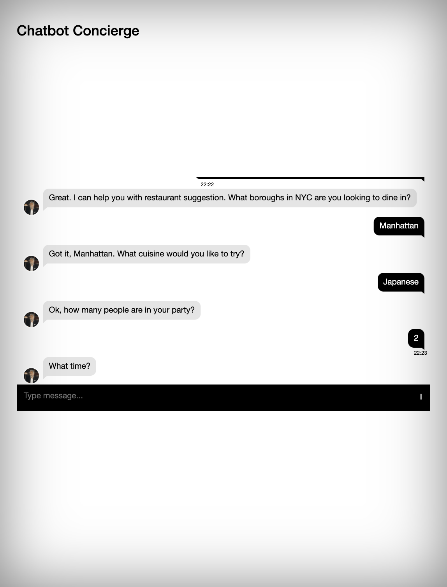

# a1-diningconcierge

_Yankai Li (yl4632)_  
_Tracy Li (ml4683)_
  

This implementation is a serverless, microservice-driven web application. Specifically, a Dining Concierge chatbot that sends the user restaurant suggestions given a set of preferences that the user provides to the chatbot through conversation.

## To Run
Open the url in a browser: https://a1diningconcierge.s3.amazonaws.com/chat.html
  
## Architecture Diagram

  
## Chatbot Screenshot

  
## Used Services
- AWS S3 bucket - host the front-end
- API Gateway - setup API/Swagger
- Lambda Function 0 (LF0) - post and receive message between API Gateway and Lex
- Amazon Lex - build Dining Concierge chatbot, support GreetingIntent, DiningSuggestionIntent, and ThankYouIntent
- Lambda Function 1 (LF1) - provide error handling and fullfillment for Lex; send Lex info in DiningSuggestIntent to SQS queue 
- SQS - provide a queue for sending and receiving message
- Lambda Function 2 (LF2) - receive message from SQS queue asynchronously through Queue Lambda trigger; query in OpenSearch with the given info and choose 3 random selected restaurant suggestions from restaurant data in DynamoDB; send the restaurant suggestion message to phone and email
- ElasticSearch/OpenSearch - store restaurant ID, cuisine type, and location for basic query
- DynamoDB - store detailed restaurant information (Business ID, Name, Address, Coordinates, Number of Reviews, Rating, Zip Code, and Others) from Yelp
- SNS - send messages to phone (currently reach sandbox limit)
- SES - send messages to email 

## Structure
cloud-hw1-starter contains front end code, aics-swagger.yaml contains yaml file for API gateway, lambda-functions contains the three lambda functions, yelp_scrapping.ipynb contains scrapping code to get restaurant info from Yelp and codes to write data to DynamoDB and OpenSearch.
